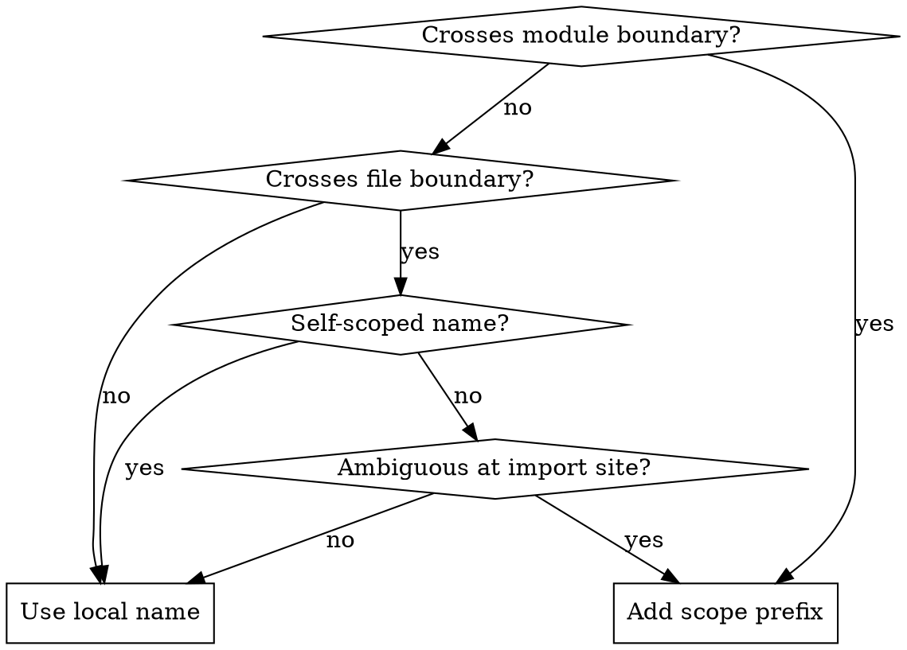

# Naming Conventions

## Overview

Names should reflect their scope. Use the shortest name that's clear in context. Add scope only when code crosses file or module boundaries and the shorter name would be ambiguous.

## Rules

1. **Inside a file** — use the shortest clear name (no prefix)
2. **Across module boundaries** — always add a scope prefix to exports (e.g. `schema` → `userSchema`)
3. **Across file boundaries within the same module** — add a scope prefix only when the local name would be ambiguous at the import site
4. **Self-scoped names** don't need additional prefixes because they embed their domain directly. Two patterns:
   - **verb + domain**: `formatDate`, `readSession`, `parseCsv` — the domain disambiguates
   - **domain + type**: `emailSchema`, `pageSizeOptions`, `userFilters` — the domain qualifies the type

**Note:** Export names reflect domain scope, not filename casing. A file `dashboard.tsx` in the `home/` directory exports `Dashboard` locally and `HomeDashboard` when scope is needed — the name comes from the domain concept, not the kebab-case filename.

**Default exports** undermine naming conventions because they defer the name to every import site. Prefer named exports so the export site controls the canonical name.

## Quick Reference

| File | Local (inside file) | Scoped (exported, cross-boundary) |
|------|---------------------|-----------------------------------|
| `users/schema.ts` | `schema` | `userSchema` |
| `reports/query.ts` | `query` | `reportQuery` |
| `orders/types.ts` | `Filters` | `OrderFilters` |
| `pages/home/dashboard.tsx` | `Dashboard` | `HomeDashboard` (only when broader usage needs context) |
| `shared/formatting/date.ts` | `formatDate` | `formatDate` (self-scoped: verb+domain) |
| `shared/storage/session.ts` | `readSession` | `readSession` (self-scoped: verb+domain) |
| `shared/validation/email.ts` | `emailSchema` | `emailSchema` (self-scoped: domain+type) |
| `shared/table/constants.ts` | `pageSizeOptions` | `pageSizeOptions` (self-scoped: domain+type) |

## Decision Flowchart

## Common Mistakes

| Mistake | Fix |
|---------|-----|
| Over-scoping local variables (`userUserName`) | Drop scope that's implied by context |
| Under-scoping cross-module exports (`schema` exported from `users/schema.ts`) | Always add module context (`userSchema`) |
| Adding scope "just in case" across files within the same module | Only add scope when a name would be ambiguous at the import site |
| Using type-based suffixes for everything (`UserType`, `UserInterface`) | Only add type suffixes when it disambiguates from a value with the same base name |
| Prefixing by directory name instead of domain concept (`UsersDirSchema`) | Use domain-relevant prefixes (`userSchema`), not filesystem-derived ones |
| Default exports with no canonical name | Prefer named exports so the export site controls the name |