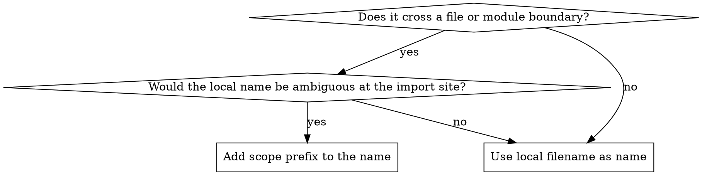

# Naming Conventions

## Overview

Names should reflect their scope. Use the shortest name that's clear in context. Add scope only when code crosses file or module boundaries and the shorter name would be ambiguous.

## Rules

1. **Prefer local filenames** — use the shortest clear name within a file's own scope
2. **Prefer scoped exported names** — add context when an export will be used outside its file or module

**Note:** Export names reflect domain scope, not filename casing. A file `dashboard.tsx` in the `home/` directory exports `Dashboard` locally and `HomeDashboard` when scope is needed — the name comes from the domain concept, not the kebab-case filename.

## Quick Reference

| File | Local (inside file) | Scoped (exported, cross-boundary) |
|------|---------------------|-----------------------------------|
| `users/schema.ts` | `schema` | `userSchema` |
| `reports/query.ts` | `query` | `buildReportQuery` |
| `orders/types.ts` | `Filters` | `OrderFilters` |
| `pages/home/dashboard.tsx` | `Dashboard` | `HomeDashboard` (only when broader usage needs context) |
| `shared/formatting/date.ts` | `formatDate` | `formatDate` (already scoped by verb+domain) |
| `shared/storage/session.ts` | `readSession` | `readSession` (already scoped) |
| `shared/validation/email.ts` | `emailSchema` | `emailSchema` (already scoped) |
| `shared/table/constants.ts` | `pageSizeOptions` | `pageSizeOptions` (already scoped) |

## Decision Flowchart

## Common Mistakes

| Mistake | Fix |
|---------|-----|
| Over-scoping local variables (`userUserName`) | Drop scope that's implied by context |
| Under-scoping cross-module exports (`schema` exported from `users/schema.ts`) | Add module context (`userSchema`) |
| Adding scope "just in case" | Only add scope when a name would be ambiguous at the import site |
| Using type-based suffixes for everything (`UserType`, `UserInterface`) | Only add type suffixes when it disambiguates from a value with the same base name |